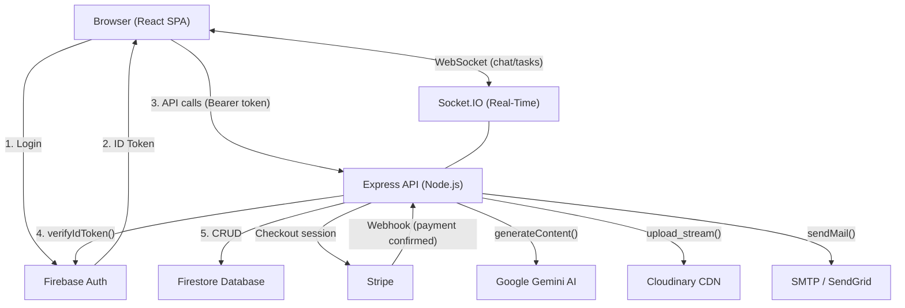
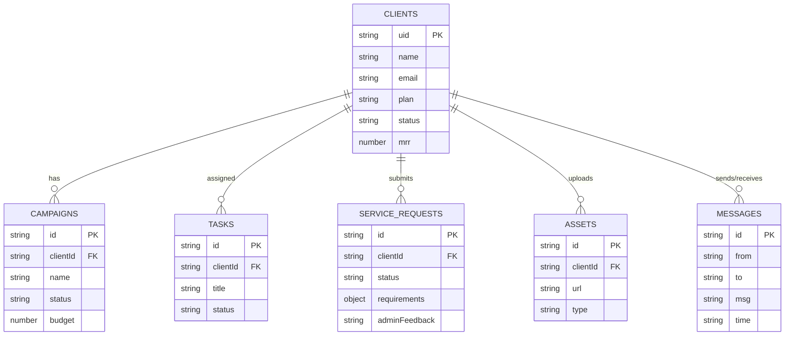

# Nexus — Project Wiki

> A structured knowledge base covering architecture, data flows, domain model, and onboarding for the Nexus full-stack SaaS platform.

---

## Table of Contents

1. [Principal-Level Architecture Guide](#1-principal-level-architecture-guide)
2. [Zero-to-Hero Onboarding Path](#2-zero-to-hero-onboarding-path)
3. [Domain Model](#3-domain-model)
4. [System Components Deep Dive](#4-system-components-deep-dive)
5. [Data Flows](#5-data-flows)
6. [File Reference](#6-file-reference)
7. [Glossary](#7-glossary)

---

## 1. Principal-Level Architecture Guide

### Core Architectural Insight

Nexus is a **Firebase-native SaaS** where **Firebase owns all identity and state**, and the Express backend acts as a **thin, stateless orchestration layer** between Firebase services, Stripe, Cloudinary, and Google AI.

The key pattern is: **no server-side sessions, no JWT signing, no user tables**. Every request is authenticated by having the backend ask Firebase to verify the client's token. This means you can scale the Express process horizontally without any session-store complexity.

```python
# Python equivalent to illustrate the session-less auth pattern:
def verify_token(request):
    token = request.headers.get("Authorization", "").replace("Bearer ", "")
    user = firebase_admin.auth.verify_id_token(token)  # delegates to Google
    request.user = user  # attaches decoded claims
    return next(request)
```

### System Architecture



### Design Tradeoffs

| Decision | Chosen Approach | Alternative | Why |
|---|---|---|---|
| Auth | Firebase Auth (delegated) | DIY JWT with bcrypt | Zero security surface, built-in OAuth, MFA |
| Database | Firestore (NoSQL, document) | PostgreSQL (relational) | Fast to prototype; no schema migrations; Firebase Admin SDK is the only DB client needed |
| Real-Time | Socket.IO over HTTP server | Firestore real-time listeners | Server-controlled broadcast; admin push without client polling |
| File storage | Cloudinary | AWS S3 | Free tier handles MVP; media transformation built-in |
| AI | Gemini 2.5 Flash | OpenAI GPT-4o | Google ecosystem fit; cheaper per token at this scale |

### Where to Go Deep

1. `server.js` — The application entry: how Express, Socket.IO, and cron are wired together
2. `routes/api.js` — The complete route table; the contract surface of the backend
3. `middleware/authMiddleware.js` — The security perimeter (20 lines, guards everything)
4. `controllers/serviceRequestController.js` — The most complex business logic: brief approval chain
5. `contexts/AuthContext.jsx` — The frontend's global auth state machine
6. `controllers/aiController.js` — The AI integration: prompt construction, Gemini call, image URL generation

---

## 2. Zero-to-Hero Onboarding Path

### Part I — Technology Foundations

**Express.js** — The backend framework. You define routes like `router.get('/campaigns', handler)`. Middleware runs before handlers. The `next()` function passes control to the next middleware.

**Firebase** — Two distinct SDKs in use:
- **Firebase Admin SDK** (`nexus-back/config/firebaseAdmin.js`) — Server-side. Reads env secrets, verifies tokens, writes to Firestore.
- **Firebase Client SDK** (`nexus-frontend/src/services/firebase.js`) — Browser-side. Manages user sessions, returns ID tokens.

**Firestore** — A NoSQL document database from Google. Data is organized into **collections** (like tables) and **documents** (like rows, but schema-free). Example: `db.collection('clients').where('uid', '==', uid).get()`.

**Socket.IO** — Real-time bidirectional communication. Uses WebSockets under the hood. Clients **emit** events and **listen** for events. The server can target specific users via **rooms**.

**React + Vite** — The frontend framework and build tool. Components are functions that return JSX. State is managed with `useState`, side effects with `useEffect`. The `AuthContext` provides global auth state via the Context API.

### Part II — This Codebase's Architecture

#### How authentication works end-to-end

```
1. User clicks "Login" → Firebase Client SDK authenticates → Returns currentUser
2. currentUser.getIdToken() → Returns a short-lived JWT
3. Axios interceptor (services/api.js) → Reads token, adds "Authorization: Bearer <token>" to every request
4. Express receives request → authMiddleware.js → Calls admin.auth().verifyIdToken(token)
5. Firebase servers validate the token → Return decoded payload { uid, email, ... }
6. req.user = decodedToken → Controller knows who is making the request
```

#### How the client-admin role split works

There are no `roles` stored in Firestore or Firebase Custom Claims. Instead:

```js
// contexts/AuthContext.jsx — line 89
const isAdmin = currentUser && ADMIN_EMAILS.includes(currentUser.email);
```

- If the logged-in email is in the `ADMIN_EMAILS` array → they're treated as admin in the UI
- `AdminRoute.jsx` redirects non-admins away from `/admin`
- The backend does **not** enforce admin-only routes — this is enforced only on the frontend

#### How the AI Content Studio works

```
Client fills form → POST /api/ai/generate
→ aiController.js builds a structured prompt from productName + description + targetAudience + contentType
→ Sends prompt to Gemini 2.5 Flash with responseMimeType: 'application/json'
→ Parses the JSON response
→ If "image" type was requested: builds a Pollinations.ai URL from the returned imagePrompt
→ Returns all content types in a single response object
```

### Part III — Dev Setup and Navigation

1. **Start the backend:** `cd nexus-back && npx nodemon server.js`
2. **Start the frontend:** `cd nexus-frontend && npm run dev`
3. **Create an admin account:** Register normally, then add your email to `ADMIN_EMAILS` in `contexts/AuthContext.jsx:18`
4. **Test the API:** Use the Swagger-style reference at `nexus-back/API_REFERENCE.md`
5. **Add a new route:** Add handler to a controller → import it in `routes/api.js` → register the route

---

## 3. Domain Model

### Collections (Firestore)

```
clients
├── uid          (string)    Firebase Auth UID — used as the foreign key everywhere
├── name         (string)    Display name / company name
├── email        (string)
├── plan         (string)    "Pending Request" | "STARTER" | "GROWTH" | "ENTERPRISE"
├── status       (string)    "active" | "inactive"
├── mrr          (number)    Monthly Recurring Revenue (set manually or via approval)
├── campaigns    (number)    Campaign count
├── avatar       (string)    First letter of name
└── since        (string)    Human-readable date: "Mar 2026"

campaigns
├── name         (string)
├── status       (string)    "active" | "paused" | "completed"
├── budget       (number)
├── clientId     (string)    → clients.uid
└── [other fields as needed per campaign]

tasks
├── title        (string)
├── status       (string)    "todo" | "in_progress" | "done"
├── clientId     (string)    → clients.uid
└── assignedAt   (string)    ISO timestamp

messages
├── from         (string)    Firebase UID or "admin"
├── to           (string)    Firebase UID or "admin_room"
├── msg          (string)    Message text
├── type         (string)    "text" | "image"
└── time         (string)    ISO timestamp (auto-set by server)

serviceRequests
├── clientId     (string)    → clients.uid
├── clientName   (string)
├── clientEmail  (string)
├── requirements (object)    { selectedTier, goals, targetAudience, ... }
├── status       (string)    "pending_payment" | "pending_admin_review" | "approved" | "needs_clarification"
├── adminFeedback (string)   Populated on rejection
├── createdAt    (string)    ISO timestamp
├── approvedAt   (string)    ISO timestamp (set on approval)
├── rejectedAt   (string)    ISO timestamp (set on rejection)
├── paymentStatus  (string)  "paid" (set by Stripe webhook)
└── stripeSubscriptionId (string)

assets
├── clientId     (string)    → clients.uid
├── name         (string)    Display name
├── url          (string)    Cloudinary secure_url
├── type         (string)    MIME type (e.g., "image/png")
└── uploadedAt   (string)    ISO timestamp
```

### ER Diagram



---

## 4. System Components Deep Dive

### `server.js` — Application Bootstrap

The entry point wires three independent systems onto one Node.js process:

1. **Express HTTP server** — handles REST API requests
2. **Socket.IO** — rides on top of the same HTTP server via `http.createServer(app)`
3. **node-cron** — runs a background job at midnight every day

```
httpServer
├── Express (handles HTTP)
│   └── /api/* → routes/api.js
└── Socket.IO (handles WebSocket)
    ├── join_room
    ├── send_message
    └── assign_task
```

### `middleware/authMiddleware.js` — The Security Perimeter

Every route behind `verifyToken` checks:
1. Does the `Authorization` header exist and start with `Bearer `?
2. Is the token a valid, non-expired Firebase ID token? (checked against Google's public keys)

If either fails, the request is rejected with 401/403 before it touches any controller.

### `routes/api.js` — The Route Table

The single file that maps every URL to its controller function and applies `verifyToken` to each. It also applies `express-rate-limit` per IP. Adding a new feature means:

1. Write a new controller function
2. Import it here
3. Add `router.METHOD('/path', verifyToken, controllerFn)`

### `contexts/AuthContext.jsx` — Frontend Auth State Machine

Wraps the entire React app. Provides:
- `currentUser` — Firebase user object or `null`
- `isAdmin` — derived boolean
- `registerClient`, `login`, `loginWithGoogle`, `logout`, `resetPassword` — auth actions

Uses `onAuthStateChanged` to react to sign-in/sign-out events globally. All pages that need user info call `useAuth()` to access this context.

### `services/api.js` — The Axios Instance

A pre-configured Axios client that automatically:
1. Sets `baseURL` to the backend URL
2. Before every request: calls `currentUser.getIdToken()` and inserts the `Authorization: Bearer` header

This means no page-level code ever needs to manually handle auth headers.

---

## 5. Data Flows

### New Client Registration

```
User fills signup form (LandingPage / Login)
→ AuthContext.registerClient(name, email, password)
→ Firebase: createUserWithEmailAndPassword()
→ Firebase: updateProfile({ displayName: name })
→ api.post('/clients', { uid, name, email, plan: "Pending Request", ... })
→ clientController.createClient()
  → Firestore: clients.add(newClient)
  → emailService.sendWelcomeEmail(email, name) [async, fire-and-forget]
→ User is now logged in (onAuthStateChanged fires)
→ ProtectedRoute allows access to /client
```

### AI Brief Submission & Approval

```
Client fills brief form (ClientDashboard)
→ api.post('/checkout/create-session', { requirements, clientId, ... })
→ stripeController.createCheckoutSession()
  → Firestore: serviceRequests.add({ status: 'pending_payment' })
  → Stripe: checkout.sessions.create({ mode: 'subscription', ... })
→ Client is redirected to Stripe Checkout page
→ Client pays
→ Stripe webhook: POST /stripe/webhook (checkout.session.completed)
→ stripeController.handleStripeWebhook()
  → Firestore: serviceRequests.update({ status: 'pending_admin_review', paymentStatus: 'paid' })

Admin sees request in AdminDashboard
→ Admin clicks "Approve"
→ api.put('/service-requests/:id/approve')
→ serviceRequestController.approveServiceRequest()
  → Firestore: serviceRequests.update({ status: 'approved' })
  → Firestore: clients.update({ plan: selectedTier, status: 'active' })
  → emailService.sendBriefApprovedEmail(clientEmail, tier) [async]
```

### Real-Time Chat Flow

```
Admin types message → socket.emit('send_message', { clientId, from, msg })
→ server.js socket handler → io.to(clientId).emit('receive_message', data)
                           → io.to('admin_room').emit('receive_message', data)
→ Client browser (listening) → socket.on('receive_message') → UI update

[In parallel]
Admin also calls → api.post('/messages', { from, to, msg })
→ messageController.createMessage()
  → Firestore: messages.add(newMessage) ← for persistence / history
  → emailService.sendNewMessageNotification(clientEmail, 'Admin') [async]
```

---

## 6. File Reference

| File | Purpose |
|---|---|
| `nexus-back/server.js` | App entry: Express setup, Socket.IO, cron jobs |
| `nexus-back/routes/api.js` | All REST routes; applies auth middleware |
| `nexus-back/middleware/authMiddleware.js` | Firebase JWT verification |
| `nexus-back/config/db.js` | Firestore client singleton |
| `nexus-back/config/firebaseAdmin.js` | Firebase Admin SDK init |
| `nexus-back/controllers/clientController.js` | Client CRUD + welcome email |
| `nexus-back/controllers/campaignController.js` | Campaign CRUD |
| `nexus-back/controllers/taskController.js` | Task CRUD |
| `nexus-back/controllers/messageController.js` | Message persistence + email notify |
| `nexus-back/controllers/serviceRequestController.js` | AI brief lifecycle (create/approve/reject) |
| `nexus-back/controllers/stripeController.js` | Stripe checkout + webhook handler |
| `nexus-back/controllers/aiController.js` | Gemini AI content generation |
| `nexus-back/controllers/assetController.js` | Cloudinary upload + Firestore record |
| `nexus-back/services/emailService.js` | Nodemailer email templates |
| `nexus-back/services/adNetworkSync.js` | Cron: nightly sync with ad networks |
| `nexus-back/models/Client.js` | Client data model class |
| `nexus-back/models/Campaign.js` | Campaign data model class |
| `nexus-back/models/Task.js` | Task data model class |
| `nexus-back/models/Message.js` | Message data model class |
| `nexus-frontend/src/App.jsx` | React router + route guards |
| `nexus-frontend/src/contexts/AuthContext.jsx` | Global auth state + Firebase actions |
| `nexus-frontend/src/services/api.js` | Axios instance with auth interceptor |
| `nexus-frontend/src/services/firebase.js` | Firebase client SDK init |
| `nexus-frontend/src/components/ProtectedRoute.jsx` | Redirects unauthenticated users to `/login` |
| `nexus-frontend/src/components/AdminRoute.jsx` | Redirects non-admins to `/login` |
| `nexus-frontend/src/pages/LandingPage.jsx` | Public marketing/signup page |
| `nexus-frontend/src/pages/Login.jsx` | Client login page |
| `nexus-frontend/src/pages/AdminLogin.jsx` | Admin login page |
| `nexus-frontend/src/pages/ClientDashboard.jsx` | Client portal (tasks, chat, brief, assets) |
| `nexus-frontend/src/pages/AdminDashboard.jsx` | Admin control panel |

---

## 7. Glossary

| Term | Definition |
|---|---|
| **Firebase** | Google's backend-as-a-service platform. Nexus uses Firebase Authentication and Firestore. |
| **Firestore** | Google's NoSQL document database. The primary data store for all Nexus entities. |
| **ID Token** | A short-lived JWT issued by Firebase Auth after a user logs in. Sent in every API request. |
| **verifyToken** | The Express middleware that validates Firebase ID tokens on protected routes. |
| **Socket.IO** | A library for real-time, bidirectional WebSocket communication. Used for chat and task assignment. |
| **Room** | A Socket.IO channel. Clients join a room named after their UID; all sockets also join `admin_room`. |
| **Service Request** | An AI Marketing Brief submitted by a client, representing a request to activate an AI agent. |
| **Tier** | A subscription level: STARTER ($199), GROWTH ($299), or ENTERPRISE ($499) per month. |
| **Admin** | A user whose email is in the `ADMIN_EMAILS` array in `AuthContext.jsx`. Not enforced server-side. |
| **Cron** | A scheduled job. Nexus uses `node-cron` to run `syncWithAdNetworks()` every night at midnight. |
| **Cloudinary** | A cloud media platform. Nexus uses it to store and serve client-uploaded assets. |
| **Gemini** | Google's large language model (Gemini 2.5 Flash). Powers the AI Content Studio. |
| **Pollinations.ai** | A free AI image generation service. Used to create image URLs from Gemini's image prompts. |
| **Nodemailer** | A Node.js email sending library. Configured with SMTP credentials (SendGrid-compatible). |
| **SMTP** | Simple Mail Transfer Protocol — the protocol used to send emails. |
| **MRR** | Monthly Recurring Revenue — a KPI tracked per client. |
| **AuthContext** | React Context that provides auth state (`currentUser`, `isAdmin`) and auth actions to all components. |
| **ProtectedRoute** | A React component that wraps client-only pages; redirects to `/login` if not authenticated. |
| **AdminRoute** | A React component that wraps admin-only pages; redirects if the user is not an admin. |
